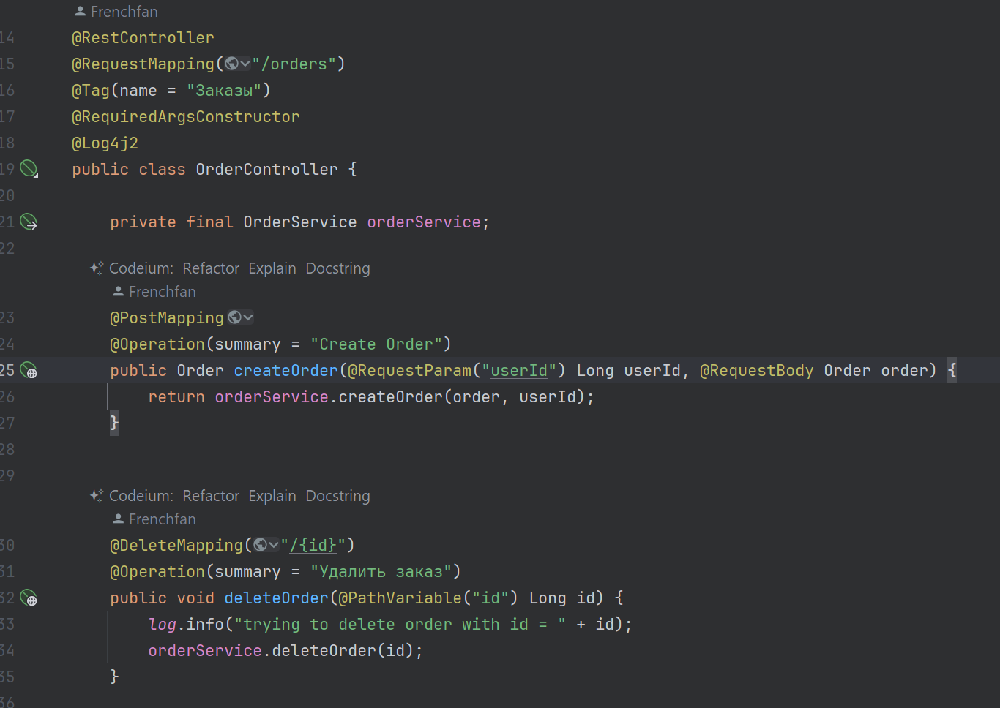
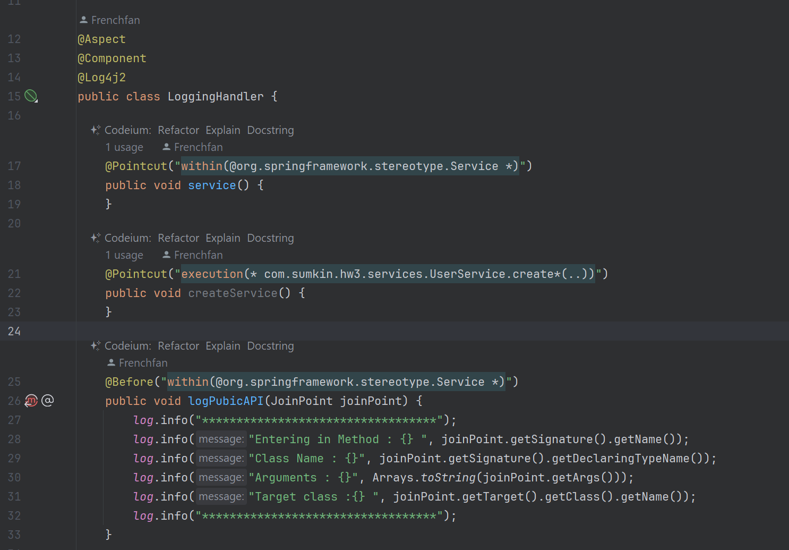
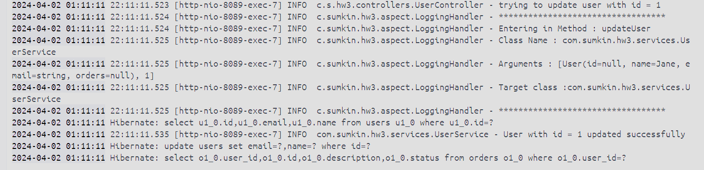
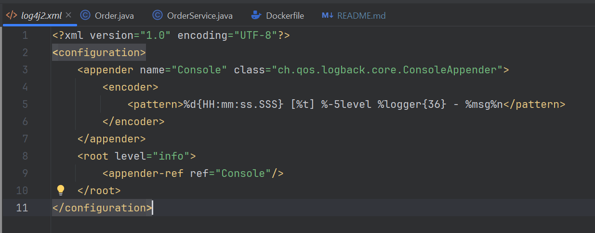

Демонстрационный проект - Spring AOP logging

Как запустить:

Откройте проект через Intellij Idea (New -> Project from Version control) ```https://github.com/Frenchfan/HW2-Kafka.git ```

После того, как проект полностью подгрузится, используйте панель справа для работы с maven:
выберите HW2-Kafka, затем clean, затем package.

Аналогично проделайте для KafkaConsumer.

Теперь, если у Вас установлен Docker, можно запустить docker-compose.yml: либо в командной строке
```docker-compose up -d```, либо через IntellijIdea, открыв docker-compose и запустив его 
(двойной треугольник слева от services).

В течение нескольких минут будут скачены все необходимые образы и собраны в образы приложения
http://localhost:8087/swagger-ui/index.html - swagger для создания fake метрики.

FakeMetrics состоит из 3-х полей: температура (temperature),влажность (humidity) и комментария (comment) 

Все документировано, есть примеры. Для работы со swagger продюсера требуется авторизация!!!

user и password - producer (реализована basic authorization)


http://localhost:7070/topics - RedPanda Console - удобная среда для работы с Kafka

http://localhost:8088/swagger-ui/index.html# - swagger консьюмера для метрики 

Реализована сортировка, пагинация, фильтрация / группировка (можно отобрать все 
метрики с температурой выше указанной в запросе), можно получать метрики по одной

В консьюмере метрики приходят с дополнительными данными из Kafka (key - авторизованный 
пользователь, который передал метрику, timestamp - время из Kafka, по которому 
зарегистрирована метрика и kafkaId - это offset из Kafka)

Обилие дополнительных визуальных сервисов максимально упрощают работу.

Полный список открытых endpoint можно получить в swagger 