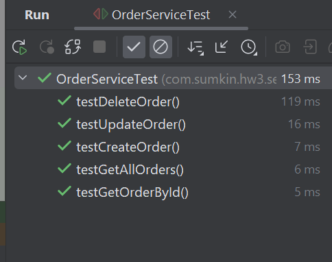
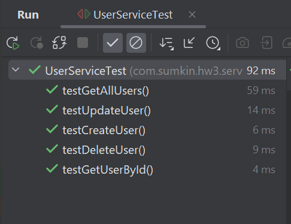

Демонстрационный проект - Spring AOP logging

Как запустить:

Откройте проект через Intellij Idea (New -> Project from Version control) 
```https://github.com/Frenchfan/HW3-SpringAOP ```

После того, как проект полностью подгрузится, используйте панель справа для работы с maven:
выберите HW3, затем clean, затем package.

Теперь, если у Вас установлен Docker, можно запустить docker-compose.yml: либо в командной строке
```docker-compose up -d```, либо через IntellijIdea, открыв docker-compose и запустив его 
(двойной треугольник слева от services).

В течение нескольких минут будут скачены все необходимые образы и собраны в образы приложения
http://localhost:8089/swagger-ui/index.html - swagger для удобного тестирования.

В приложении представлены 2 класса-сущности User и Order с соответствующими полями
(id, имя, email для пользователя; id, описание, статус для заказа).

Операции с сущностями записываются в бд Postgres 16.0

Все документировано. 

В приложении реализовано несколько уровней логирования: 
- стандартное, например, на уровне контроллера:

- аспектно-ориентированное 


Реализованы различные типы аспектов: @Before, @AfterThrowing, @AfterReturning
с различными pointcut

Вот пример лога при обновлении данных пользователя:


Логирование настроено на вывод в консоль. Настройка - через конфигурационный
xml :


Сервисный слой покрыт тестами. Сборка проекта (package) через maven подразумевает 
автоматический запуск тестов. Можно, однако, их и вручную запустить





Полный список открытых endpoint можно получить в swagger 